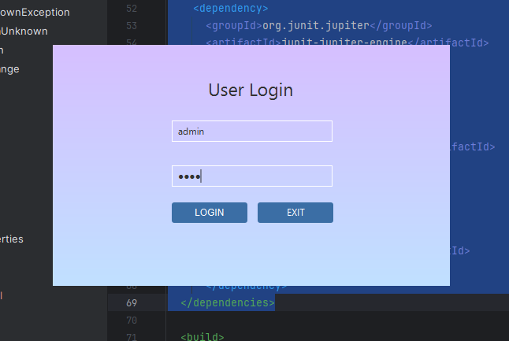
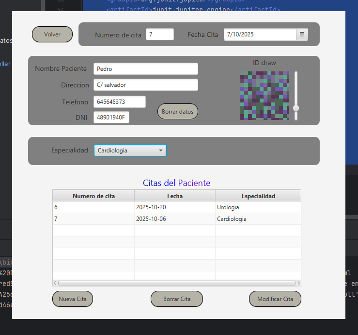

# PRACTICA-1-DE-BASES-DE-DATOS-RELACIONALES

-----

Practica de bases de datos con MySQL y JavaFX. Hemos hecho uso del hash SHA256(commons-codec) para
alamacenar las contraseñas de forma segura. Tambien hemos usando JUnit para hacer
pruebas unitarias de algunas partes del codigo

-----

## Partes graficas

La interfaz grafica consta de un panel de login y un formulario para los pacientes.

### Login

El login contiene dos campos de texto, se elimino el marco de la ventana por lo que la unica mandera de finalizar la aplicacion a traves de la GUI es con este boton de "exit":



### Formulario Paciente

al ingresa un usuario, se buscara los datos del usuario que contiene el correo ingresado, se mostrara los datos y se mostrara adicionalmente un "ID draw" que representa informacion unica de este paciente. 
Se puede pulsar la tecla Backspace(borrar) para eliminar los datos de los campos. 

Al poner un DNI en dicho campo, y presionar los datos, obtendremos los datos de este paciente.

Podremos añadir, modificar y borrar citas como queramos:



## dependencias

```xml
<dependencies>
    <dependency>
      <groupId>org.openjfx</groupId>
      <artifactId>javafx-controls</artifactId>
      <version>21.0.6</version>
    </dependency>
    <dependency>
      <groupId>org.openjfx</groupId>
      <artifactId>javafx-fxml</artifactId>
      <version>21.0.6</version>
    </dependency>
<dependency>
      <groupId>org.controlsfx</groupId>
      <artifactId>controlsfx</artifactId>
      <version>11.2.1</version>
    </dependency><dependency>
      <groupId>com.dlsc.formsfx</groupId>
      <artifactId>formsfx-core</artifactId>
      <version>11.6.0</version>
      <exclusions>
        <exclusion>
          <groupId>org.openjfx</groupId>
          <artifactId>*</artifactId>
        </exclusion>
      </exclusions>
    </dependency><dependency>
      <groupId>org.kordamp.bootstrapfx</groupId>
      <artifactId>bootstrapfx-core</artifactId>
      <version>0.4.0</version>
    </dependency>
<dependency>
      <groupId>org.junit.jupiter</groupId>
      <artifactId>junit-jupiter-api</artifactId>
      <version>${junit.version}</version>
      <scope>test</scope>
    </dependency>
    <dependency>
      <groupId>org.junit.jupiter</groupId>
      <artifactId>junit-jupiter-engine</artifactId>
      <version>${junit.version}</version>
      <scope>test</scope>
    </dependency>
      <dependency>
          <groupId>com.mysql</groupId>
          <artifactId>mysql-connector-j</artifactId>
          <version>9.4.0</version>
      </dependency>

      <dependency>
          <groupId>commons-codec</groupId>
          <artifactId>commons-codec</artifactId>
          <version>1.16.0</version>
      </dependency>
  </dependencies>
```

